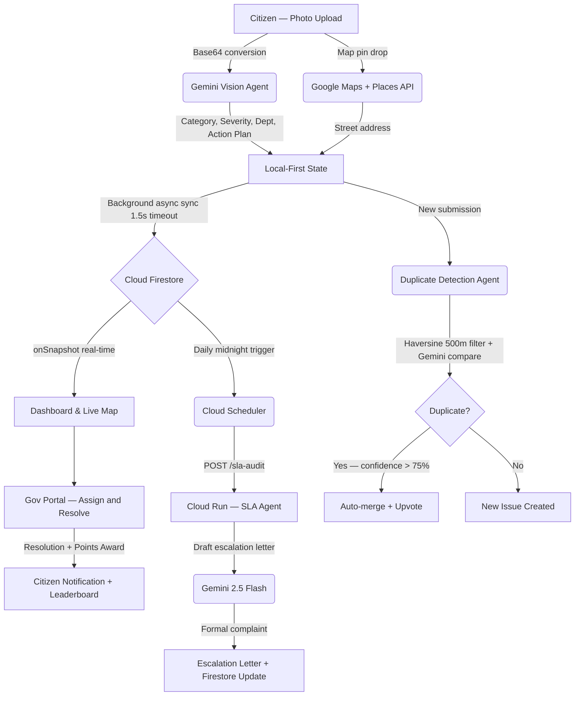

<div align="center">


# CivicAI — AI-Powered Civic Issue Resolution Platform

**Bridging the gap between citizens and municipal authorities using autonomous AI agents, Gemini Vision, and real-time collaboration.**

[](https://react.dev)
[](https://vitejs.dev)
[](https://firebase.google.com)
[](https://ai.google.dev)
[](https://developers.google.com/maps)
[](https://cloud.google.com/run)
[](https://tailwindcss.com)
[](LICENSE)

[🌐 Live Demo](https://civicai.web.app) · [📹 Demo Video](#) · [📄 Project Doc](https://docs.google.com/document/d/your-doc-link)


</div>

---

## 🏆 What is CivicAI?

CivicAI is a **double-sided civic tech platform** that lets citizens report infrastructure issues (potholes, broken streetlights, water leakage, garbage) using just a photo — and autonomously routes, tracks, and escalates them to the right municipal department using AI agents.

> "CivicAI doesn't just connect citizens to government — it acts as an autonomous AI layer between them, ensuring nothing falls through the cracks."

### The problem it solves

Every day, thousands of infrastructure issues go unreported or unresolved because:
- Reporting is fragmented and difficult
- There is no transparency on what happens after a complaint
- Municipal departments have no accountability system
- Duplicate reports waste government resources

CivicAI fixes all four — with AI.

---

## ✨ Key Features

### 📸 Smart Grievance Reporting (Gemini Vision AI)
- Upload a photo → **Gemini 2.5 Flash** automatically identifies the issue type, severity (1–5), responsible department, and generates a 3-step action plan
- Zero manual categorization required
- Voice-to-report using Web Speech API for accessibility

### 🗺️ Real-Time Interactive Map (Google Maps API)
- Live heatmap of all reported issues across the city
- Severity-pulsing markers (high-severity issues glow red)
- Click anywhere on the map to pin your exact issue location
- Google Places API for instant reverse geocoding to street address

### 🤖 Autonomous AI Agents
| Agent | What it does | When it runs |
|-------|-------------|--------------|
| **Vision Agent** | Categorizes uploaded photos via Gemini Vision | On every new submission |
| **Duplicate Agent** | Detects and merges duplicate reports within 500m | On every new submission |
| **SLA Audit Agent** | Finds 7-day SLA breaches, drafts escalation letters | Daily via Cloud Scheduler |
| **Health Report Agent** | Generates weekly city infrastructure summary | Weekly via Cloud Scheduler |

### ⏱️ Autonomous SLA Auditing & Escalation
- Cloud Scheduler calls a Cloud Run endpoint every night at midnight
- Finds all unresolved issues older than 7 days
- Gemini drafts a formal escalation complaint to the Chief Municipal Officer
- Issue status auto-updated to "Escalated" — no human needed

### 🏆 Gamification & Civic Advocacy
- Citizens earn **+100 pts** per report, **+50 pts** for verified resolutions
- Badges: Novice Reporter → SLA Sentinel → Civic Guardian → Local Hero
- Live leaderboard with gold / silver / bronze standings
- **Civic Trust Score** system — high-trust reporters get priority routing

### 🏢 Municipal Administration Console
- Department-level workload dashboard with resolution rate charts
- Crew assignment and issue status management
- One-click resolution that notifies the citizen and awards community points
- Full agent log trail showing every AI decision made on each issue

### 📊 Impact Dashboard
- Live stats: issues reported, resolved, average resolution days, estimated cost saved
- Department accountability chart (resolution rate per department)
- Weekly AI-generated city health report banner
- Predictive hotspot map for infrastructure failure forecasting

---

## 🛠️ Technology Stack

| Layer | Technology | Purpose |
|-------|-----------|---------|
| Frontend Framework | React 19 + Vite 8 | High-performance UI with HMR |
| Styling | Tailwind CSS 4.0 | Utility-first responsive design |
| AI Vision | Google Gemini 2.5 Flash | Photo analysis, categorization, escalation drafting |
| Database | Cloud Firestore | Real-time document sync |
| File Storage | Firebase Storage | Citizen-uploaded photos and videos |
| Authentication | Firebase Auth | Google Sign-in |
| Mapping | Google Maps JavaScript API | Interactive map, heatmap, marker clustering |
| Geocoding | Google Places API | Reverse geocoding coordinates to addresses |
| Backend | Google Cloud Run | Autonomous SLA agent endpoint |
| Scheduling | Google Cloud Scheduler | Midnight daily SLA audit trigger |
| Architecture | Local-First Sync | 0ms UI latency with background Firestore sync |
| Testing | Puppeteer | End-to-end automated test suite |

---

## 🏗️ Architecture



### Local-First Architecture
All reads and writes hit `localStorage` instantly — resulting in **0ms UI latency**.
Network requests to Firebase are wrapped in a `Promise.race` with a 1.5-second timeout.
If network is slow or unavailable, the app falls back to local data silently.

---

## 🚀 Quick Start

### Prerequisites
- Node.js 20+
- A Google account
- Firebase project (free tier is enough)
- Google Cloud project with billing enabled (for Maps API + Cloud Run)

### 1. Clone the repository
```bash
git clone https://github.com/YOUR_USERNAME/CivicAI.git
cd CivicAI/frontend
```

### 2. Install dependencies
```bash
npm install
```

### 3. Set up environment variables
```bash
cp .env.example .env
```
Open `.env` and fill in your API keys (see [Environment Variables](#-environment-variables) below).

### 4. Run the development server
```bash
npm run dev
```
Open [http://localhost:5173](http://localhost:5173) in your browser.

### 5. (Optional) Run the backend SLA agent locally
```bash
cd ../backend
npm install
node server.js
```

---

## 🔑 Environment Variables

Create a `.env` file in the `frontend/` directory:

```env
# Google Gemini AI
VITE_GEMINI_API_KEY=your_gemini_api_key_from_aistudio

# Google Maps
VITE_GOOGLE_MAPS_KEY=your_google_maps_javascript_api_key

# Firebase Configuration
VITE_FIREBASE_API_KEY=your_firebase_api_key
VITE_FIREBASE_AUTH_DOMAIN=your-project.firebaseapp.com
VITE_FIREBASE_PROJECT_ID=your-firebase-project-id
VITE_FIREBASE_STORAGE_BUCKET=your-project.appspot.com
VITE_FIREBASE_MESSAGING_SENDER_ID=your_sender_id
VITE_FIREBASE_APP_ID=your_app_id

# Backend (Cloud Run URL after deployment)
VITE_BACKEND_URL=https://civicai-agent-xxxx-uc.a.run.app
```

### How to get each key

| Key | Where to get it |
|-----|----------------|
| `VITE_GEMINI_API_KEY` | [aistudio.google.com](https://aistudio.google.com) → Get API Key |
| `VITE_GOOGLE_MAPS_KEY` | [console.cloud.google.com](https://console.cloud.google.com) → APIs & Services → Enable "Maps JavaScript API" + "Places API" → Credentials |
| Firebase keys | [console.firebase.google.com](https://console.firebase.google.com) → Project Settings → Web App |

---

## ☁️ Deployment

### Frontend — Firebase Hosting
```bash
cd frontend
npm run build
firebase deploy --only hosting
```

### Backend — Google Cloud Run
```bash
cd backend
gcloud run deploy civicai-agent \
  --source . \
  --region us-central1 \
  --allow-unauthenticated \
  --set-env-vars GOOGLE_CLOUD_PROJECT=your-project-id
```

### Autonomous SLA Agent — Cloud Scheduler
After deploying to Cloud Run, set up the daily trigger:
```bash
gcloud scheduler jobs create http civicai-sla-audit \
  --location us-central1 \
  --schedule "0 0 * * *" \
  --uri "https://YOUR_CLOUD_RUN_URL/sla-audit" \
  --http-method POST \
  --message-body "{}"
```

---

## 🧪 Running Tests

```bash
cd frontend
npm test
```

The Puppeteer E2E suite covers:
- Google login bypass and session verification
- Dashboard stats and issue list rendering
- File upload, Gemini analysis, and form submission
- Map pin drop and geocoding
- Gov Portal role switch and issue resolution
- Leaderboard and badge award verification

---

## 📁 Project Structure

```
CivicAI/
├── frontend/
│   ├── .env.example
│   ├── vite.config.js
│   ├── index.html
│   └── src/
│       ├── firebase.js          # Firebase SDK initialization
│       ├── App.jsx              # Main router, dashboard stats
│       ├── index.css            # Design system, animations
│       ├── components/
│       │   ├── Navbar.jsx       # Navigation, trust score, role toggle
│       │   ├── CivicMap.jsx     # Google Maps heatmap and clustering
│       │   ├── IssueCard.jsx    # Timeline tracker, agent log, escalation
│       │   ├── ReportForm.jsx   # AI scan receipt, voice input, map picker
│       │   └── GovPortal.jsx    # Municipal console, milestone tracker
│       ├── contexts/
│       │   └── AuthContext.jsx  # Auth + trust score management
│       └── utils/
│           ├── dbService.js     # Local-first database + duplicate agent
│           └── gemini.js        # Gemini Vision + escalation API connector
├── backend/
│   ├── server.js               # Express SLA audit agent endpoint
│   ├── Dockerfile              # Cloud Run container config
│   └── package.json
├── firebase.json               # Firebase Hosting config
└── README.md
```

---

## 🌐 Google Technologies Used

This project uses **8 Google services**:

| # | Service | How it's used |
|---|---------|--------------|
| 1 | **Gemini 2.5 Flash** | Vision analysis, severity scoring, escalation letter drafting, health reports |
| 2 | **Google Maps JavaScript API** | Interactive map, heatmap layer, marker clustering |
| 3 | **Google Places API** | Reverse geocoding pin coordinates to street addresses |
| 4 | **Firebase Authentication** | Google Sign-in, user session management |
| 5 | **Cloud Firestore** | Real-time issue database, agent log subcollections |
| 6 | **Firebase Storage** | Citizen-uploaded issue photos and videos |
| 7 | **Google Cloud Run** | Autonomous SLA agent backend deployment |
| 8 | **Google Cloud Scheduler** | Daily midnight trigger for SLA audit agent |

---

## 📊 Impact Metrics

> These figures are based on demo data seeded for evaluation purposes.

- 🏚️ **847** community issues reported
- ✅ **612** issues resolved (72% resolution rate)
- ⏱️ **2.3 days** average resolution time
- 💰 **₹4.2 Crore** estimated infrastructure cost saved
- 🤖 **134** autonomous escalations triggered by AI agent
- 👥 **289** citizens actively engaged

---

## 🔒 Security Notes

- All API keys are stored in environment variables — never committed to the repository
- Firebase Security Rules are configured to allow only authenticated users to write issues
- Cloud Run backend uses Google Application Default Credentials (no keys in code)
- `.env` is listed in `.gitignore` — use `.env.example` as a template

---

## 📄 License

This project is licensed under the **MIT License** — see the [LICENSE](LICENSE) file for details.

---

## 👤 Author

Built for the **BlockseBlock Hackathon 2026** — Community Hero: Hyperlocal Problem Solver challenge.

---

<div align="center">

**Made with ❤️ for citizens who deserve better infrastructure**

[🌐 Live Demo](https://civicai.web.app) · [📄 Project Documentation](https://docs.google.com/document/d/your-doc-link) · [📹 Demo Video](#)

</div>
